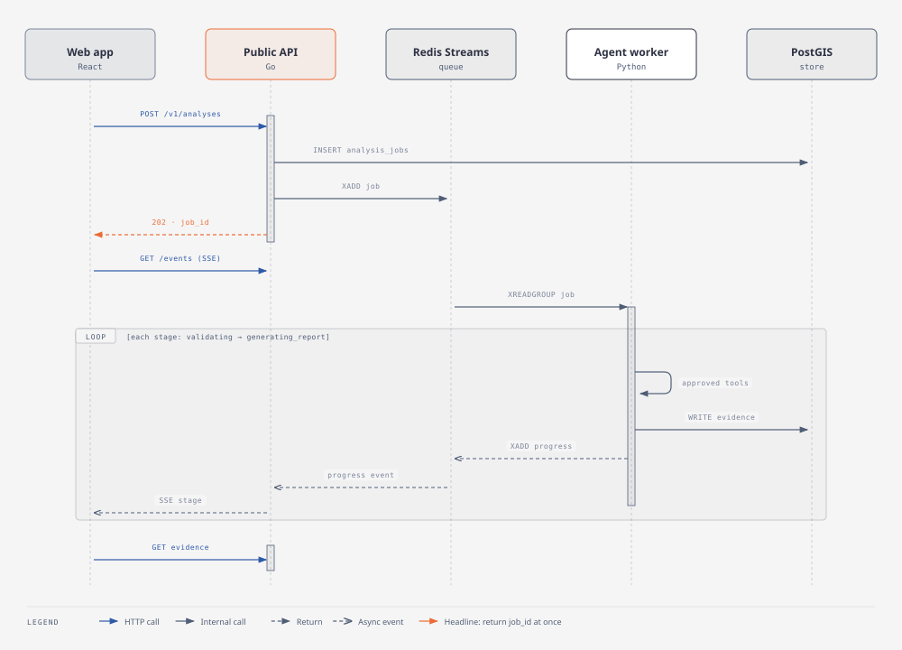
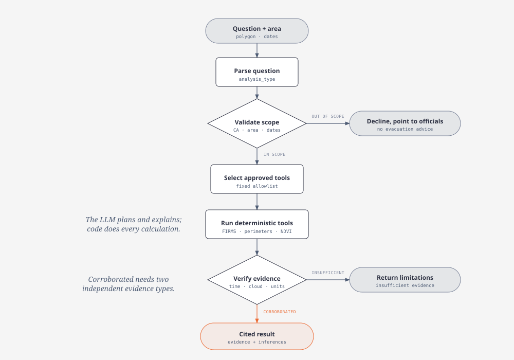
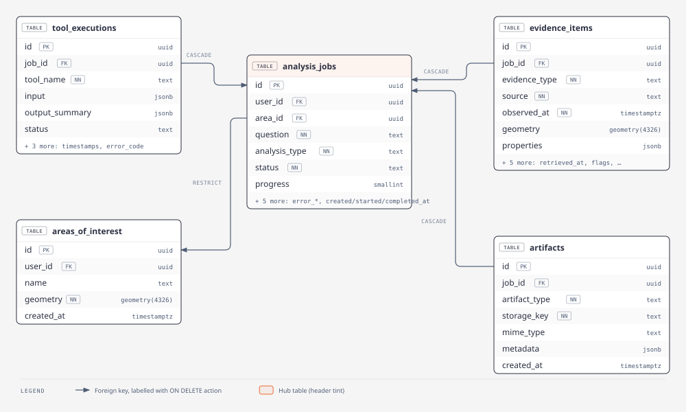
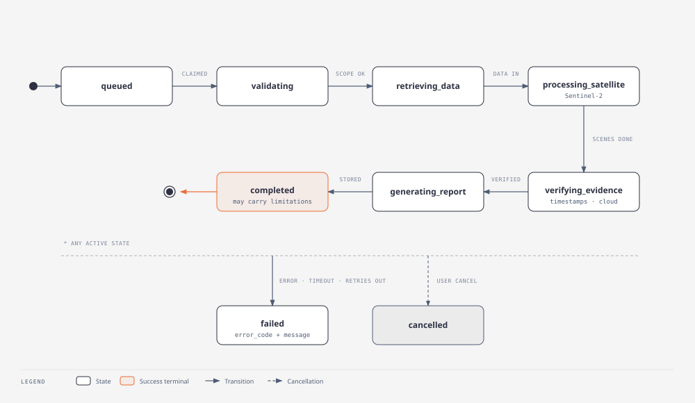
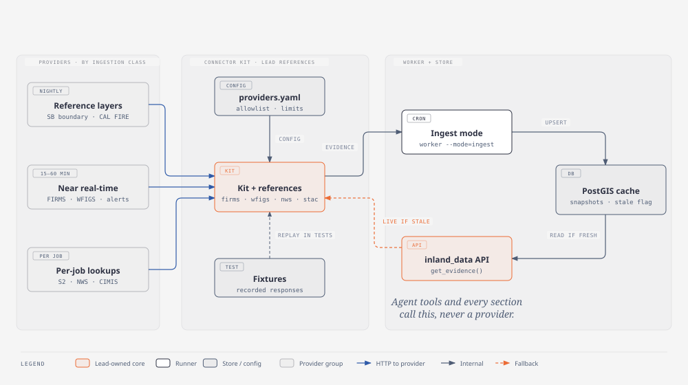
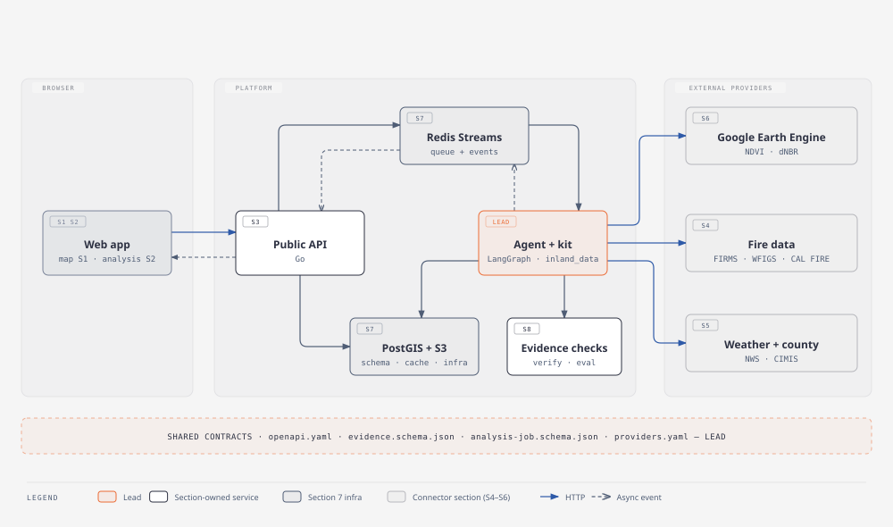

# Inland Resilience Agent: design docs

Start here. Source spec: `Inland_Resilience_Agent_Project_Spec.md` (Sep 23, 2026).

## Diagrams

The `.svg` files render here on GitHub. Open the matching `.html` file in a browser for exact fonts and extra notes.

### Architecture: three apps, one boundary each

### Request lifecycle: the API answers first, the worker does the work

### Agent workflow: fixed tools, evidence before answers

### Database schema

### Job state machine

### Ingestion pipeline: one kit in, one API out

### Team ownership

## For everyone
- **[Start here](guides/start-here.md)** · [Learning with AI](guides/learning-with-ai.md) · [Coding with OpenCode](guides/coding-with-opencode.md)
- [Sections: who builds what](sections/README.md): ownership, order of work, pairing, definition of done
- [Architecture decisions](adr/README.md)

## For data work
- **[Data catalog](data-catalog.md)**: every source, its `provider_id`, how to get it in one line, owner and status
- [Connector guide](connectors/connector-guide.md): how to add a provider and how to read data
- [Provider spec template](connectors/provider-spec-template.md) and [provider specs](connectors/providers/)
