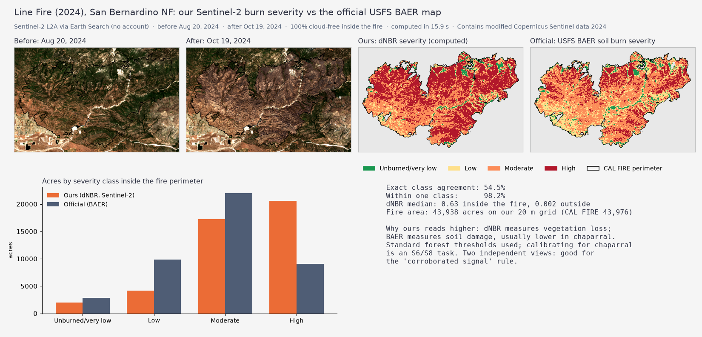

# Proof of concept: Line Fire 2024 burn severity without Earth Engine

Run on Sep 24, 2026 to check [ADR-009](../../adr/ADR-009-imagery-without-earth-engine.md) before committing to it.



**What it does:** finds the least-cloudy Sentinel-2 L2A scenes before (Aug 20, 2024) and after (Oct 19, 2024) the fire through Earth Search (no account); reads only the fire area from the image files; masks clouds with SCL; computes NBR and dNBR; classifies severity; and compares that pixel-by-pixel with the official USFS BAER soil burn severity map on the same 20 m grid.

**Result** ([results.json](results.json)): 100% cloud-free pixels inside the perimeter, about 16 s end to end, dNBR median 0.63 inside the fire vs 0.002 outside, **54.5% exact class agreement, 98.2% within one class**. Our "High" is larger than BAER's because dNBR measures vegetation loss while BAER measures soil damage. The thresholds are the standard USGS forest values and need calibrating for chaparral (S6/S8).

**Lessons that go into `kit/imagery.py`:**
1. **Scaling:** apply the −0.1 BOA offset **only when** `earthsearch:boa_offset_applied` is false, checked per item. Asset metadata advertises the offset either way. Getting it wrong produced impossible dNBR values (> 2) in the first run.
2. **Duplicates:** one date can have two processing versions (`…_0_L2A` and `…_1_L2A`); use one per tile.
3. **Geometry:** the CAL FIRE Line Fire perimeter is invalid (self-touching ring); repair it (`make_valid`) before use.
4. **BAER** `exportImage` works on our own grid (`bboxSR`/`imageSR` 32611, nearest neighbour); pixel values 1–4 = Unburned-very low / Low / Moderate / High.

## Run it yourself

```bash
make demo-line-fire     # Docker, no keys: writes output/results.json + the figure (~30 s)
```
or without Docker: `cd apps/worker && uv run --group research python research/line_fire_2024.py --out /tmp/line-fire`.

The script is [`apps/worker/research/line_fire_2024.py`](../../../apps/worker/research/line_fire_2024.py): self-contained research code (it downloads the perimeter, imagery and BAER map itself), and the reference for `kit/imagery.py` and S6. It isn't production code.

Contains modified Copernicus Sentinel data 2024.
