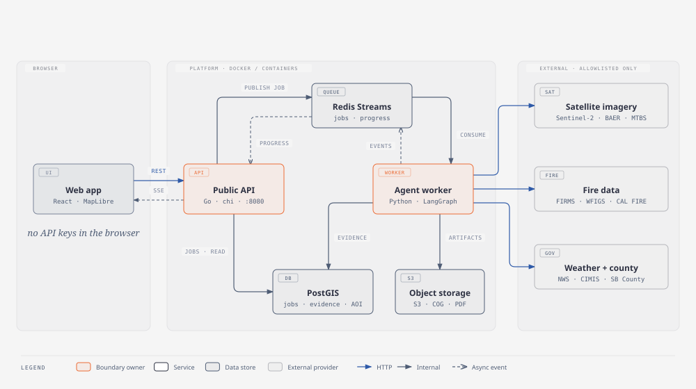

# Section 1: Map frontend

**Stack:** React · TypeScript · Vite · MapLibre GL JS · Tailwind CSS · Vitest + React Testing Library
**Pair partner:** Section 4 (fire connectors): you make sure the geography they produce draws correctly.
**Read first:** [Start here](../guides/start-here.md) · [Learning with AI](../guides/learning-with-ai.md) · [Coding with OpenCode](../guides/coding-with-opencode.md)

---

## 1. Your job in plain English

You build **the map**: the first thing every user sees, and the thing the whole product is organised around.

The user opens the app and sees San Bernardino County with its boundary outlined. They can draw an area to analyse. When results come back, your map shows them as layers: red dots for satellite heat detections, outlines for official fire perimeters, and coloured satellite images showing vegetation change or burn severity. Clicking something opens a popup that says what it is, **where the data came from, and when**.

**Analogy:** you're building the display case in a museum. The curators (other sections) supply the artefacts and the labels. Your job is to show them clearly, let visitors choose what to look at, and never let a label go missing.



**Done looks like:** a user can open the app, see the county, draw a valid area, toggle layers on and off, read a legend, and click any feature to see its source, time and limitations.

## 2. What you own

| You own | Don't touch (ask the owner) |
|---|---|
| `apps/web/*` root config (`package.json`, `vite.config.ts`, `tsconfig.json`, Tailwind config) | `apps/web/src/analysis/**`, `apps/web/src/api/**` (S2) |
| `apps/web/src/app/**` (app shell, layout, routing) | `contracts/**` (lead) |
| `apps/web/src/map/**` (everything map) | anything in `apps/api`, `apps/worker` |

S2 works in the same app, so agree on the page layout with them early (e.g. map on the left, analysis panel on the right).

## 3. Key ideas before you start

| Term | Plain-English meaning |
|---|---|
| **Component** | A reusable piece of UI written as a function that returns what to show (React). |
| **State / props** | *State* is data a component remembers; *props* are data passed in from a parent. |
| **GeoJSON** | The standard JSON format for map shapes: `Point`, `LineString`, `Polygon`, with `properties`. Everything we draw arrives as GeoJSON. |
| **WGS84 / EPSG:4326** | The longitude/latitude coordinate system. GeoJSON coordinates are `[longitude, latitude]`. Longitude comes **first**, and that's a classic bug. |
| **Source and layer** | In MapLibre, a *source* is the data (e.g. a GeoJSON file) and a *layer* is how it's drawn (circles, lines, fills). One source can feed several layers. |
| **Raster tiles** | Pre-cut square images for each zoom level. Satellite results arrive as tile URLs from our API (`/v1/tiles/...`). |
| **Legend** | The key that explains colours and symbols. Every layer needs one. |
| **Popup** | The info box when you click a feature. Ours must show source, observed time, retrieved time and limitations. |
| **Fixture** | A saved example data file used instead of live data during development. |

## 4. Learn the stack (week 0)

Follow the [5-step method](../guides/learning-with-ai.md) for each tool. Do the practice exercise **outside** the project first.

| Tool | Why we use it | Official docs | Practice exercise |
|---|---|---|---|
| React | Builds the UI from components | [react.dev/learn](https://react.dev/learn) | A counter + a list you can filter. |
| TypeScript | Catches type mistakes before runtime | [typescriptlang.org/docs](https://www.typescriptlang.org/docs/) | Type a `Feature` object with `geometry` and `properties`. |
| Vite | Dev server and bundler | [vite.dev/guide](https://vite.dev/guide/) | `npm create vite@latest` → React + TS template, run it. |
| MapLibre GL JS | The interactive map | [maplibre.org/maplibre-gl-js/docs](https://maplibre.org/maplibre-gl-js/docs/) (see its Examples) | Show a map, add a GeoJSON point layer, add a popup on click. |
| Tailwind CSS | Styling with utility classes | [tailwindcss.com/docs](https://tailwindcss.com/docs) | Style a legend box with a coloured dot and text. |
| Vitest + Testing Library | Unit and component tests | [vitest.dev](https://vitest.dev/guide/) · [testing-library.com](https://testing-library.com/docs/react-testing-library/intro/) | Test that a legend renders the right label. |
| GeoJSON spec | The data format | [geojson.org](https://geojson.org/) | Hand-write a Polygon around your house on [geojson.io](https://geojson.io/). |

**Learn it with AI:**
```text
I know basic JavaScript but I'm new to React and MapLibre GL JS. Explain the difference
between a MapLibre "source" and a "layer" with a GeoJSON example, then explain how I'd
keep the map in sync with React state without re-creating the map on every render.
```

## 5. Set up your machine

```bash
# Node.js LTS (includes npm): https://nodejs.org/  (or: brew install node)
node --version        # should print v20 or newer
git clone https://github.com/samin1554/inland-resilience.git
cd inland-resilience
# Install OpenCode: see docs/guides/coding-with-opencode.md
```

Until S7's `make dev` exists (Milestone 0), you'll create the Vite app in `apps/web` yourself (ticket S1-0) and run it with `npm run dev`.

## 6. Build it step by step

Each ticket: **goal → steps → AI prompt (paste in Plan mode) → check yourself → tests → common mistakes → done when.**

### S1-0 Create the web app skeleton
- **Goal:** `apps/web` exists and runs at `localhost:5173`.
- **Steps:** scaffold Vite React + TS in `apps/web`, add Tailwind, add Vitest, add a basic layout: a header, a map area, and an empty right panel for S2.
- **AI prompt:**
  ```text
  Plan how to scaffold apps/web as a Vite + React + TypeScript app with Tailwind and Vitest,
  following AGENTS.md. Keep it minimal. Layout: header, map area (left, flexible), and an empty
  <aside id="analysis-panel"> on the right for Section 2. List every file you'll create.
  ```
- **Check yourself:** `npm run dev` works; `npm test` runs one passing test; no extra libraries beyond those listed.
- **Common mistakes:** committing `node_modules`; putting secrets in `VITE_*` variables.
- **Done when:** a teammate can clone, `npm install`, `npm run dev`, and see the layout.

### S1-1 Map shell on San Bernardino County
- **Goal:** the app opens on the county with its boundary drawn.
- **Input:** the boundary fixture `database/fixtures/sb_county_boundary.geojson` (from S4/S7; until it exists, draw a rough polygon on geojson.io and save it as a temporary fixture in `apps/web/src/map/fixtures/`).
- **Steps:** create a `MapView` component; initialise MapLibre once; add the boundary as a GeoJSON source with a line layer; fit the map to the boundary's bounds.
- **AI prompt:**
  ```text
  In apps/web/src/map, plan a MapView React component using MapLibre GL JS that initialises the
  map once (useRef + useEffect), loads a GeoJSON boundary from a local fixture, draws it as an
  outline, and fits the view to its bounds. Explain how you avoid creating the map twice in
  React StrictMode. Don't write code until I approve.
  ```
- **Check yourself:** coordinates are `[lng, lat]`; the map is created only once; the base map style needs no API key (ask the lead which free style to use if unsure).
- **Tests:** a component test that the map container renders; a unit test for your "compute bounds from GeoJSON" helper.
- **Failure case:** if the fixture fails to load, show a visible error banner, not a blank map.
- **Done when:** the boundary is visible on load and the error case is handled.

### S1-2 FIRMS detections layer + legend + popup (your first "real" deliverable)
- **Goal:** show satellite heat detections from a fixture, in the evidence format.
- **Input:** a FIRMS evidence fixture (`contracts/examples/` once the lead publishes it; until then, ask S4 for a sample in the evidence shape from the [connector guide](../connectors/connector-guide.md)).
- **Steps:** a circle layer for points; a legend entry; on click, a popup with evidence type, source, `observed_at`, `retrieved_at`, confidence, FRP (MW) and the limitation text.
- **AI prompt:**
  ```text
  Plan a FIRMS detections layer for MapLibre in apps/web/src/map. Input is an array of evidence
  objects (see docs/connectors/connector-guide.md and contracts/evidence.schema.json). Show circles,
  a legend item, and a popup listing source, observed_at, retrieved_at, confidence, frp with units,
  and every limitation. Also plan the empty state when the array is empty.
  ```
- **Check yourself:** the popup **always** shows *"A thermal anomaly is not an officially confirmed wildfire."*; times are shown in a clear format with timezone; "observed" and "retrieved" are never merged into one "date".
- **Tests:** popup content test from a fixture; empty array → legend shows "No detections in this window".
- **Common mistakes:** calling a detection a "fire"; dropping the limitation text to save space.
- **Done when:** demo it with the fixture, and with an empty fixture.

### S1-3 Draw an area
- **Goal:** the user draws a polygon; it's handed to S2's form.
- **Steps:** add a drawing tool. MapLibre has no built-in drawing, so a library is needed. Propose one (e.g. [Terra Draw](https://github.com/JamesLMilner/terra-draw), which supports MapLibre) **to the lead before adding it**. Output a GeoJSON Polygon; reject it client-side if it's outside the county or self-intersecting (Go will validate again, so this is just for fast feedback).
- **AI prompt:**
  ```text
  Compare 2 options for drawing polygons on a MapLibre GL JS map in React (maintenance, size,
  license, TypeScript support). Recommend one, but don't install anything. Then plan how the drawn
  polygon is exposed to Section 2 via a small shared hook or context in apps/web/src/app.
  ```
- **Check yourself:** agree the hand-off shape with S2 (`GeoJSON Polygon` in WGS84).
- **Tests:** a helper that detects "outside county" using a simple geometry check (ask whether a small library like Turf is approved).
- **Done when:** draw → the S2 panel receives the polygon; a bad polygon shows a clear message.

### S1-4 Layer panel
- **Goal:** toggle and reorder layers: county boundary, FIRMS detections, current perimeters, historical perimeters, and raster placeholders (true colour, NDVI change, burn severity).
- **Steps:** a layer list driven by config (id, label, type, visible, order, legend); use MapLibre's layout visibility and layer ordering.
- **Tests:** toggling updates visibility; order changes are reflected.
- **Done when:** all layers from the spec §23 list can be toggled, each with a legend.

## 7. How your work connects

| You need | From | Until it's ready, use |
|---|---|---|
| Evidence format | Lead (`contracts/evidence.schema.json`) | The example in the connector guide |
| Boundary + FIRMS sample data | S4 | A hand-made fixture in `src/map/fixtures/` |
| Layers endpoint (`GET /v1/analyses/{id}/layers`) | S3 | Mock data (agree the shape with S2, who runs the mock API) |

| Others need from you | Who |
|---|---|
| The drawn polygon | S2 (analysis form) |
| Map layers that render evidence correctly | S4, S6 (they'll check their data on your map) |

## 8. When you're stuck

1. Re-read the relevant official docs page (MapLibre's examples are excellent).
2. Ask OpenCode in **Plan mode** to explain, not to fix.
3. Ask your pair partner (S4) or S2 (you share the app).
4. Post in the team chat with: what you tried, the exact error, a screenshot, and the branch name.

## 9. Coming from the lead

*The lead will fill these in as the core pieces land:*
- [x] Evidence schema v0 + real examples in `contracts/examples/evidence/` (FIRMS, WFIGS, NWS)
- [ ] The layers response shape (vector vs raster, tile template, legend metadata)
- [ ] Approved base-map style and drawing library
- [ ] Colour and symbol conventions for each evidence type
