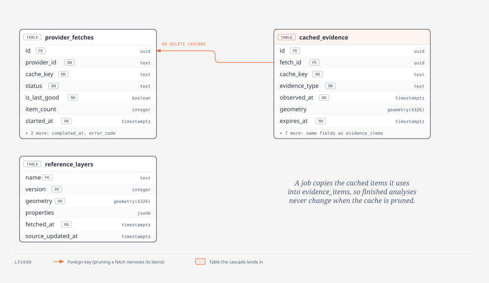

# Section 7: Platform and data infrastructure

**Stack:** Docker + Docker Compose · PostgreSQL + PostGIS · Redis · MinIO (local S3) · SQL migrations · GitHub Actions · Make
**Pair partner:** Section 5 (weather connectors): together you make scheduled refreshes and caching work.
**Read first:** [Start here](../guides/start-here.md) · [ADR-001](../adr/ADR-001-hybrid-ingestion.md) · [ADR-006](../adr/ADR-006-cache-and-snapshots.md) · [Learning with AI](../guides/learning-with-ai.md) · [Coding with OpenCode](../guides/coding-with-opencode.md)

---

> **Already built for you** ([details](../platform-status.md))
>
> - **A working worker image** (`infrastructure/docker/worker.Dockerfile`, with `worker` and `research` stages) and **a compose file** (`infrastructure/docker-compose.yml`: `worker`, `worker-test`, `line-fire-demo`). **Extend these; don't start over.**
> - **A `Makefile`** with the worker and Docker targets (`make help`). Keep them working when you add `dev`, `migrate`, `seed`.
> - **`.env.example`** lists every variable the worker reads.
> - **Tables you'll create:** spec §10 + `cancel_requested_at` (ADR-003) + the cache tables (ADR-006); see the [schema](../diagrams/database-schema.svg) and [cache schema](../diagrams/cache-schema.svg) diagrams.
>
> **Your part of Milestone 1:** **S7-1 → S7-3**: `make dev` with Postgres/PostGIS, Redis, MinIO, API and web; the first migrations; CI. Everyone depends on these. See [Milestone 1](../milestone-1.md).


> **Coming next (ADR-012/013):** seed the region with `scripts/build_region_seed.py --seed-out …`; tables and a refresh service for the activity feed. Reference: `database/migrations/0003_*`, `0004_*` and the `worker-activity` compose service on `demo/full-stack`.

## 1. Your job in plain English

You build **the ground everyone else stands on**:

- **One command to run everything.** A new teammate types `make dev` and gets the web app, the Go API, the Python worker, the database, the queue and file storage running, without installing Postgres or Redis themselves.
- **The database structure.** The tables for jobs, evidence, tool traces, artifacts, and the cache/snapshot tables for scheduled data, created by versioned migration files.
- **Automatic checks (CI).** Every pull request runs linters and tests for all three apps, validates the contracts, and blocks leaked secrets.
- **The scheduled refresh runner** (`worker --mode=ingest`), which keeps FIRMS, perimeters and alerts fresh in the cache.

**Analogy:** you're the stage crew. Nobody in the audience sees you, but if the lights, sound and stage aren't set up, no actor can perform.





**Done looks like:** a fresh clone → `make dev` → everything healthy in a few minutes; `make test` and CI are green; migrations and seeds can run twice without breaking anything.

## 2. What you own

| You own | Don't touch |
|---|---|
| `infrastructure/**` (Compose, Dockerfiles in `infrastructure/docker/`, deployment) | app source code in `apps/**` (except the ingest runner below) |
| `database/**` (migrations, fixtures/seeds) | `contracts/**` (lead) |
| `Makefile`, `.github/**`, `.env.example` | `providers.yaml` (lead: you *read* its schedules) |
| `apps/worker/src/inland_worker/ingest/**` | |
| `docs/onboarding.md`, `CONTRIBUTING.md` | |

Schema changes affect S3 and the lead, so every migration PR needs one of them as a reviewer.

## 3. Key ideas before you start

| Term | Plain-English meaning |
|---|---|
| **Container / image** | An image is a packaged app + its dependencies; a container is a running copy of it. |
| **Docker Compose** | One YAML file that starts several containers together, with networking and volumes. |
| **Volume** | Storage that survives container restarts (so the database isn't wiped). |
| **Health check** | A command Compose runs to know a service is really ready (e.g. `pg_isready`). |
| **Migration** | A numbered SQL file (`0003_add_cache_tables.sql`) applied in order. Never edit an applied migration; add a new one. |
| **Idempotent** | Safe to run twice: `make seed` twice shouldn't duplicate data. |
| **PostGIS** | The PostgreSQL extension for geometry: `geometry(Geometry, 4326)`, spatial indexes (GiST), `ST_Within`. |
| **CI** | Continuous integration: GitHub Actions runs checks on every PR. |
| **Secret scanning** | A CI step that fails if something looks like an API key. |
| **Cron schedule** | `*/30 * * * *` = every 30 minutes. The ingest runner reads these from `providers.yaml`. |

## 4. Learn the stack (week 0)

| Tool | Why | Official docs | Practice exercise |
|---|---|---|---|
| Docker | Containers | [Docker: Get started](https://docs.docker.com/get-started/) | Containerise a "hello" Python script. |
| Docker Compose | Multi-service dev | [Compose docs](https://docs.docker.com/compose/) | Compose with Postgres + a tiny app that connects to it. |
| PostgreSQL | Database | [PostgreSQL tutorial](https://www.postgresql.org/docs/current/tutorial.html) | Create a table, insert, query, add an index. |
| PostGIS | Geometry in SQL | [postgis.net/documentation](https://postgis.net/documentation/) | Store a polygon and test a point with `ST_Within`. |
| Migrations tool | Versioned schema | Pick one with the lead: [golang-migrate](https://github.com/golang-migrate/migrate) or [dbmate](https://github.com/amacneil/dbmate) (both plain SQL) | Write an up + down migration and apply it. |
| Redis Streams | The job queue | [Redis Streams](https://redis.io/docs/latest/develop/data-types/streams/) | `XADD` / `XREADGROUP` / `XACK` with `redis-cli`. |
| MinIO | Local S3 | [MinIO docs](https://min.io/docs/minio/container/index.html) | Run it in Compose; upload a file with the console. |
| GitHub Actions | CI | [docs.github.com/actions](https://docs.github.com/en/actions) | A workflow running `pytest` on push. |
| GNU Make | Short commands | [GNU Make manual](https://www.gnu.org/software/make/manual/make.html) | A Makefile with `dev`, `test`, `lint` targets. |

**Learn it with AI:**
```text
Explain Docker Compose healthchecks and depends_on (condition: service_healthy) using Postgres +
Redis + an app as the example. Then explain named volumes vs bind mounts, and which to use for a
database in local development.
```

## 5. Set up your machine

Install [Docker Desktop](https://docs.docker.com/get-docker/), Git and Make (macOS: `xcode-select --install` provides make), plus Node, Go and Python so you can run each app's lint/test locally. Clone the repo and install OpenCode.

## 6. Build it step by step

### S7-1 `make dev` (Milestone 0 exit condition)
- **Goal:** one command runs everything with health checks green. `infrastructure/docker-compose.yml` already has the `worker`, `worker-test` and `line-fire-demo` services, and the `Makefile` has the worker/Docker targets: **extend them**.
- **Steps:** add `postgres` (PostGIS image), `redis`, `minio`, `api` (:8080), `worker-ingest` and `web` (:5173) next to the existing worker services; health checks; `depends_on` conditions; `.env.example` completed; `make dev` checks that `.env` exists and says which variables are missing.
- **AI prompt:**
  ```text
  Extend the existing infrastructure/docker-compose.yml (keep its worker, worker-test and line-fire-demo services) with: PostGIS, Redis, MinIO, a Go API (apps/api, :8080),
  a Python worker and a second worker in --mode=ingest (apps/worker), and a Vite web app
  (apps/web, :5173). Include healthchecks, depends_on with service_healthy, named volumes, and a
  Makefile with dev/test/lint/migrate/seed. Placeholder apps are fine for now. List files first.
  ```
- **Done when:** a teammate on a clean machine runs `make dev` and sees all services healthy.

### S7-2 First migrations + seed
- **Goal:** the spec §10 tables exist.
- **Steps:** enable PostGIS; create `users`, `areas_of_interest`, `analysis_jobs` (+ `cancel_requested_at`, [ADR-003](../adr/ADR-003-job-retries-and-cancellation.md)), `evidence_items`, `tool_executions`, `artifacts`; GiST indexes on geometry; seed the county boundary from S4's fixture.
- **Check yourself:** `make migrate && make seed` twice → no errors, no duplicates. Down-migrations work.
- **Review:** S3 + the lead.

### S7-3 CI
- **Goal:** every PR is checked automatically.
- **Steps:** jobs for web (lint + Vitest), api (`go vet` + `go test`), worker (ruff + pytest in fixture mode); validate `contracts/examples/*` against the schemas; a secret scan (e.g. [gitleaks](https://github.com/gitleaks/gitleaks)); fail on a fixture containing a key pattern.
- **Done when:** a deliberately broken test makes the PR red.

### S7-4 Cache tables + ingest runner
- **Goal:** scheduled data refresh ([ADR-001](../adr/ADR-001-hybrid-ingestion.md), [ADR-006](../adr/ADR-006-cache-and-snapshots.md)).
- **Steps:** migrations for `provider_fetches`, `cached_evidence`, `reference_layers`; the runner reads `ingestion.schedule` from `providers.yaml` and calls the kit per provider; on success mark `is_last_good`; on failure keep the previous snapshot; prune old fetches.
- **Tests:** a simulated provider failure keeps the last good snapshot; a schedule parse test.
- **Pair with S5** for the NWS alerts schedule.

### S7-5 Onboarding doc
Write `docs/onboarding.md`: day-one setup, common errors and their fixes. Update it every time someone hits a new setup problem.

**Common mistakes:** editing an applied migration; exposing database ports publicly in deployment; committing `.env`; Compose services starting before the DB is ready.

## 7. How your work connects

| You need | From |
|---|---|
| Table requirements | Lead, S3 |
| County boundary fixture | S4 |
| `providers.yaml` schedules, kit entry point | Lead |

| Others need from you | Who |
|---|---|
| `make dev`, DB, Redis, MinIO | Everyone |
| CI | Everyone |
| Migrations | S3, lead |

## 8. When you're stuck

Docker/Postgres docs → OpenCode Plan mode (paste the exact `docker compose logs` output) → S5 (your pair) or the lead → team chat with the logs and your OS.

## 9. Coming from the lead

- [x] Worker Dockerfile, compose services and `Makefile` targets to extend (see the box at the top)
- [x] `.env.example` with every worker variable

- [ ] Choice of migration tool and ingest scheduler library
- [ ] Deployment target for Go/Python containers and the frontend host
- [ ] Final column types for the new tables
- [ ] Secrets handling in deployment (per-environment credentials)
